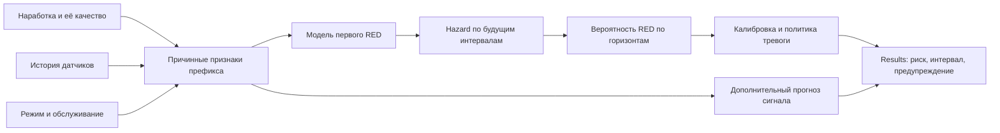

# План внедрения улучшений прогноза входа оборудования в красную зону

Дата: 2 октября 2026 года.  
Статус: готов к передаче агенту; реализация по этому плану ещё не выполнена.  
Репозиторий: `/Users/aks/01 Development/Apps/Predictive Maintenance Lab`.  
Исходная ревизия ревью: `2d87e9f`; перед реализацией проверить текущий HEAD и изменения рабочей копии.

## 1. Задача и ожидаемый результат

Создать основной сценарий **Project → Import data → Data Quality → Training → Results**, в котором модель оценивает первый будущий вход оборудования в RED по информации, доступной на момент прогноза:

- фактическая наработка и её достоверность;
- история датчиков, включая нормальную работу в зелёной зоне;
- режим эксплуатации: нагрузка, обороты, расход, температура и другие имеющиеся измерения;
- история обслуживания и возраст установленного компонента, когда такие сведения доступны.

Приложение должно выдавать вероятность RED на заданных горизонтах и, при достаточных данных и проверенной калибровке, временной интервал до события. Прогноз должен быть доступен для оценки ещё в зелёной зоне. Узкий или точный интервал в зелёной зоне не является обязательным результатом: при слабом сигнале и большом разбросе ресурса неопределённость может оставаться большой.

Основная модель должна обучаться на событие RED. Численный прогноз RMS или давления сохранить как дополнительный результат для объяснения и графика. Пересечение среднего прогноза сигнала с порогом не считать вероятностью события или калиброванным временем предупреждения.

**Приоритет:** сначала исправить цель, данные и оценку; затем сравнивать сложность архитектур и настраивать гиперпараметры.

## 2. Подтверждённое исходное состояние

| Контур | Текущий вход | Текущая цель | Что требуется изменить |
|---|---|---|---|
| Основной Projects → Training | Один `signal`; временные метки не являются входными признаками | Будущие значения RMS/давления | Добавить контекст и основной прогноз времени до RED |
| Исследовательский future-red | Несколько датчиков и режим; `operating_age_s` исключён | RED за один фиксированный горизонт: 1800 с / 20 с | Создать версию с наработкой и несколькими горизонтами; сохранить старый эксперимент |
| Исторический RUL | Датчики, режим и `operating_age_s` | Остаток до принятого конечного события | Сохранить историческую задачу, явно отделив её от RED и подтверждённого отказа |

Факты, проверенные в ревью:

- Основная подготовка оставляет `unit_id`, `timestamp_s`, `signal`, `gap_before`; контекст датчиков и наработка теряются.
- Одинаковые последовательности сигнала при разных возрастах дают одинаковые входы основного прогноза.
- Наработка, известная до момента прогноза, сама по себе не является утечкой будущего.
- `operating_age_s` в адаптерах получен из времени лабораторной записи. Для промышленного импорта это не заменяет фактические моточасы и возраст компонента.
- В bearing-RUL `event_time_s` назначен по последнему записанному фрагменту, с `event_source=last_valid_fragment_approximation`. Это не подтверждённый промышленный отказ.
- Матрица `sensor_only_20260928` использует RED при удвоении начального RMS. В текущем проекте подшипников сохранён абсолютный RED-порог **3 g**. Результаты этих целей нельзя объединять.
- Future-red GRU обнаружил 3/3 bearing-Test событий, но предупреждал на 100% оцениваемых строк риска. Full MaleCNS — 3/3 при 70,7%; trend baseline — 3/3 при 10,2%, с другим упреждением.
- Порог GRU выбран по строковому F1 Validation и составляет примерно 0,0248. Политика не ограничивает ложные эпизоды и не оптимизирует полезное упреждение.
- Выбранный основной GRU требует 24 измерения. У `Bearing3_5` первый RED по текущему порогу 3 g наступает на 13-й минуте, раньше первого допустимого прогноза на 24-й минуте.
- В bearing-Test три независимых события; в filter-Test нет наблюдённых RED-событий. На дальнем конце предложенной сетки сигнальных горизонтов остаётся одна Validation-единица.
- В ревью прошли 168 выбранных тестов и проверены хеши 59 файлов экспериментов. Это доказательство проверенных механизмов и целостности артефактов, а не качества нового прогноза. Нового полного обучения в ревью не было.

Перед внедрением перепроверить эти данные для текущих снимков. Любое изменившееся число записать в новый отчёт с идентификаторами снимка, правила RED и запуска. Отсутствие жёсткого запрета прогнозировать в зелёной зоне уже установлено; причины наблюдаемого поведения проверить абляциями.

## 3. Обязательные ограничения реализации

1. Сохранить существующие проекты, снимки, обученные модели и исторические задачи. Новые схемы и цели версионировать; старые артефакты не переинтерпретировать и не перезаписывать.
2. Сохранить несвязанные изменения рабочей копии, включая пользовательские папки `output/` и `.playwright-cli/`.
3. Все модельные входы на момент `t` должны быть известны не позднее `t`. Фактическое будущее, конец записи, время будущего события, истинный RUL и доля прожитой жизни запрещены во входах.
4. Делить данные по физическому оборудованию/компоненту. Циклы одного оборудования не должны попадать одновременно в Train и отложенную выборку.
5. Все преобразования, категории и статистики обучать на Train. Настройку модели, калибровку и политику выбирать на выделенных development-данных; финальный Test не использовать для выбора.
6. Пропуски, неизвестные исходы и неполные горизонты не превращать в отрицательные события. Конец наблюдения не считать отказом.
7. Не обнулять моточасы при потере телеметрии. Сброс контекста последовательности и изменение физического возраста компонента — разные операции.
8. Сохранить Full MaleCNS в основном Training. Использовать официальный полный граф без синтетической подмены и уменьшения числа нейронов. Новые инженерные входы и readout описать отдельно от исходной топологии.
9. Не выдавать Quantile Boosting сигнала за модель hazard путём пересечения квантилей с RED. Для вероятностного бустинга нужен отдельный явно названный адаптер/движок.
10. Пользовательские пояснения и итоговые отчёты по этой задаче писать на русском. Сохранить простой сценарий создания проекта и импорта папки; внутренние ID и технические манифесты показывать только в диагностике.

## 4. Решения, которые фиксируются до сравнения моделей

Создать версионированную конфигурацию задачи, например `configs/red_entry_protocol.yaml`. Числа качества не подбирать по уже просмотренным Test-результатам.

| Решение | Требование |
|---|---|
| Событие | Первый наблюдённый вход сигнала в RED внутри определённого цикла/эпизода риска |
| Определение RED | Версия правила, единицы, направление порога, абсолютные/относительные пределы, допустимые режимы и качество исходной базы |
| Подтверждение RED | В первой версии сохранить семантику существующего правила. Если требуется устойчивое превышение, оформить новую версию события; не смешивать его с подтверждением тревоги |
| Сценарий будущей эксплуатации | Явное допущение о режиме на горизонте; фактические будущие нагрузки не использовать. Плановый режим допустим только при доказуемой известности на момент прогноза |
| Горизонты | Упорядоченная сетка в секундах по типу оборудования; отдельная диагностика наблюдаемого покрытия каждого горизонта |
| Полезное упреждение | `minimum_action_lead_s`, определяемое временем, нужным для действия |
| Бюджет тревог | `max_false_alert_episodes_per_100_operating_hours`, `max_alert_time_fraction` |
| Качество интервала | `nominal_interval_coverage`, допустимая ширина и требования к подтверждённому покрытию |
| Достаточность данных | Минимальный состав независимых событий/режимов для оценки и калибровки; обосновать требования, не выбирать произвольное число |
| Статус допуска | `exploratory`, `requirements_unset`, `insufficient_event_evidence`, `not_passed`, `passed` |

Сохранить прежнюю цель **одна треть средней непрерывной Train-длительности** как отдельный диагностический норматив и показывать его достижимость. Не считать её гарантией модели и не заменять ею время, необходимое для обслуживания. Исследовательские 30 минут / 20 секунд также не считать автоматически достаточным временем действия.

Если эксплуатационные значения не заданы, продолжать реализацию и исследовательское обучение. Итоговый допуск оставить `requirements_unset`; не придумывать производственные требования и не останавливать независимую инженерную работу.

## 5. Целевая архитектура



Для MVP использовать условный дискретный hazard оставшегося времени. При сетке `0 = h_0 < h_1 < ... < h_K` модель выдаёт:

```text
q_j = P(T_red - t ∈ (h_{j-1}, h_j] | T_red - t > h_{j-1}, данные до t)
S_t(h_j) = product(1 - q_k), k=1..j
F_t(h_j) = 1 - S_t(h_j)
```

`F_t(h)` должна находиться в `[0,1]` и не убывать по горизонту. Калибровка не должна нарушать эти свойства.

В лабораторном MVP целевой момент — **первый записанный RED-замер по версии правила**. Дополнительно сохранять интервал между последним качественным не-RED и первым RED. Не объявлять записанный момент точным физическим временем перехода. Если позже вводится цель истинного перехода с интервальным цензурированием, она требует отдельного likelihood и версии протокола.

Медиану и квантили времени получать из распределения события. Если нужный квантиль находится за максимальным поддерживаемым горизонтом, возвращать `null` с причиной; не подставлять конец горизонта как верхнюю границу. Полосы 5–95% сигнала не использовать как временной интервал RED.

## 6. Контракты данных и результатов

### 6.1. Снимок проекта v2

Сохранить совместимость с v1 и добавить явные роли колонок: `sensor`, `operating_context`, `known_age`, `quality`, `metadata`, `target_only`. Во входы допускаются только колонки, разрешённые версионированной схемой.

Обязательные метаданные:

- `unit_id`, стабильный идентификатор физического оборудования и, при наличии, компонента;
- `cycle_id` для эксплуатационного цикла и границы обслуживания;
- `timestamp_s`, единицы/происхождение времени;
- `gap_before`, качество измерения и причины исключения;
- происхождение каждого контекстного признака и момент его доступности.

Новые признаки по наличию достоверных данных:

| Поле | Значение и ограничение |
|---|---|
| `observed_elapsed_s` | Время наблюдения; не подменяет физическую наработку |
| `operating_age_s` | Известная накопленная наработка в принятой системе отсчёта |
| `operating_age_known` / `operating_age_source` | Доступность и источник: счётчик, лабораторный прокси, неизвестно |
| `operating_time_since_component_install_s` | Время работы установленного компонента, когда известны установка и работа |
| `operating_time_since_service_s` | Время после обслуживания; ремонт не означает автоматического обнуления возраста |
| `is_running`, `delta_t_s` | Для расчёта рабочего времени и корректной интерпретации измерений |
| `rpm`, `load_kn`, `flow_rate`, `dust_feed`, температура и другие датчики | Только имеющиеся измерения с явно заданными единицами |
| Известный RED-предел, расстояние до него, начальный baseline и его доступность | Для относительного RED учитывать индивидуальный порог единицы; baseline доступен только после накопления предусмотренных правилом измерений |
| Пастовые тренды и накопленная нагрузка | Вычислять до `t`; формулу и физический смысл версионировать |

Событие замены компонента начинает новый возраст/цикл; обычный ремонт изменяет возраст только по заданному правилу. При неизвестной наработке не ставить достоверный ноль: использовать маску и явное происхождение импутации.

Для generic CSV позволить пользователю выбрать контекстные колонки и источник наработки без технического манифеста. Импорт минимального v1 CSV должен продолжить работать; для него указывать ограниченную доступность контекста.

### 6.2. Таблица событий и целей

Хранить отдельно:

- первый наблюдённый RED и версию его правила;
- подтверждённый отказ, аварийную остановку, плановое обслуживание/замену — при наличии таких записей;
- конец наблюдения и причину цензурирования;
- границы неопределённости перехода, качество и полноту наблюдения;
- для каждого origin: `at_risk`, `risk_status`, `followup_duration_s`, `event_observed`, известные/замаскированные hazard-биновые цели.

На событии и после первого RED этого цикла не обучать отрицательные примеры «до первого RED». Обработка восстановления/повторного входа требует явно начатого нового эпизода; нельзя молча считать весь остаток файла новым отрицательным периодом.

### 6.3. Контракт сохранённого run и inference

Run должен фиксировать задачу и версию, схему входов, рецепт признаков, скейлер, источник возраста, снимок данных, split, версию RED, сетку горизонтов, сценарий режима, модель, seed, selection, калибровку и политику тревоги. Хешировать входные артефакты, веса, predictions и отчёты.

Минимальный результат inference:

```text
issued_at_s
task_version, snapshot_id, model_id, red_rule_version
input_mode: age_context | sensor_only | hybrid
prediction_status: available | insufficient_context | unsupported_regime | unavailable
probability_by_horizon: [{horizon_s, probability, support_status}]
time_to_red_quantiles_s: {q05, q50, q95}  # null, если граница не поддержана
red_entry_corridor: {status, earliest_s, latest_s, nominal_coverage, calibration_status, reason}
warning: {status, policy_version, probability_horizon_s, threshold, reason_codes}
age_source, input_quality, calibration_status, quality_gate_status
```

`earliest_s/latest_s` — абсолютное время; квантиль оставшегося времени — относительное. Нельзя смешивать эти системы отсчёта. Состояние «уже RED» показывать отдельно от будущего прогноза.

## 7. Этапы внедрения и критерии приёмки

Выполнять последовательно. После каждого этапа фиксировать изменение, выполненные проверки и оставшиеся ограничения. Названия новых модулей ниже являются предлагаемыми; агент может уточнить их при сохранении контрактов.

### Этап A — протокол, версии и исходная диагностика

**Зависимости:** отсутствуют. **Приоритет:** P1.

- [ ] Проверить текущий код, проекты, снимки, правила RED и выбранные runs; сохранить компактную исходную диагностику.
- [ ] Добавить конфигурацию задачи из раздела 4 и явное разделение `signal_forecast`, `red_entry`, `legacy_rul`.
- [ ] Зафиксировать development-splits; отметить уже просмотренные Test-результаты как исследовательские.
- [ ] Для финального допуска определить новый независимый holdout либо явно указать, что его ещё нет.
- [ ] Вести происхождение split и признак использования результатов при подборе. После просмотра исходов обмен единицами с Train не должен сохранять статус независимого финального Test.

**Приёмка:** воспроизводимо определяется, какую цель, версию RED и выборку использует каждый запуск. Старые модели открываются с прежней семантикой. Недостаток новых событий не мешает следующим этапам, но исключает положительный допуск качества.

### Этап B — импорт наработки и эксплуатационного контекста

**Зависимости:** A. **Приоритет:** P1.

**Основные точки изменения:** `src/pdm/data/project_import.py`, `generic_csv.py`, `project_prepare.py`, адаптеры `bearings.py`/`filters.py`, `preprocessing.py`, `feature_recipes.py`, `history.py`.

- [ ] Ввести схему снимка v2; перестать терять доступные контекстные колонки при канонизации.
- [ ] Поддержать источник возраста, маски неизвестности, счётчик работы и компонентные циклы.
- [ ] Сохранить `rpm/load_kn` для Bearings, `flow_rate/dust_feed/dust` для Filters; лабораторный возраст пометить как прокси с описанием начала отсчёта.
- [ ] Добавить выбор колонок generic CSV; сохранить минимальный импорт без контекста.
- [ ] Реализовать причинные тренды, проверку единиц и раздельную обработку пробела телеметрии/замены компонента.
- [ ] Не обнулять интегралы физического износа при gap; если часть нагрузки неизвестна, сохранять неполноту вместо выдуманного точного значения.
- [ ] Скейлеры, категории и импутацию обучать только на Train; сохранить параметры в run.

**Приёмка:** контекст доходит от импорта до сохранённого модельного входа; изменение будущих строк не меняет признаки префикса; потеря связи не делает старый компонент новым; старые snapshots и generic v1 CSV загружаются.

### Этап C — единый экспорт событий RED и survival-целей

**Зависимости:** A, B. **Приоритет:** P1.

**Точки изменения:** `project_zones.py`, `future_red_targets.py`, экспортёры зон; предлагаемый `red_entry_targets.py` для project-scoped v2.

- [ ] Строить цели по точной версии RED конкретного проекта, включая текущие абсолютные пределы.
- [ ] Для относительного RED определить начало доступности baseline. До накопления причинной базы возвращать неизвестный статус правила; будущие первые N измерений не использовать для выдачи более раннего прогноза. Передавать известный индивидуальный порог/нормализованный контекст в модель.
- [ ] Создать таблицу событий и причин цензурирования из раздела 6.2.
- [ ] Для origin `t` событие допустимо только в будущем `(t, ...]`. Бины полностью до события получают 0; бин с наблюдённым событием — 1; после события бины не участвуют в loss.
- [ ] Для правого цензурирования включать только полностью наблюдённые отрицательные бины. Частично наблюдённый последний бин маскировать; сохранить фактическую длительность follow-up.
- [ ] При плохом качестве/разрыве завершать достоверный follow-up на последней пригодной точке. Не делать вывод «RED не было» внутри неизвестного промежутка.
- [ ] После gap отдельно проверять статус риска: если первый RED мог произойти в пропуске, не объявлять продолжение достоверно свободным от первого события. Для возобновления нужен явный допустимый протокол/новый эпизод.
- [ ] Сохранять неопределённость времени между измерениями; не приписывать конец файла отказу.
- [ ] При изменении RED создавать новые цели и инвалидировать совместимость старых event-моделей/метрик. Численную signal-модель можно использовать для иной линии порога, но это не подтверждает event-качество для нового RED.

**Приёмка:** положительные, отрицательные, цензурированные, post-event и quality/gap случаи различаются; новая разметка привязана к снимку и правилу. Исторические bearing-RUL метки не используются вместо RED.

### Этап D — базовые модели и абляции

**Зависимости:** B, C. **Приоритет:** P1.

**Предлагаемые модули:** `red_entry_baselines.py`, `red_entry_features.py`; использовать существующие причинные преобразования там, где их контракт подходит.

- [ ] Реализовать простую survival-базовую модель по наработке/режиму с цензурированными историями, например Kaplan–Meier для заранее заданных достаточно представленных групп.
- [ ] Для lifetime-кривой выдавать риск условно на уже прожитую наработку: `P(T <= a+h | T > a) = 1 - S(a+h)/S(a)` в пределах поддержки данных. Не выдавать безусловное распределение нового оборудования как остаточный ресурс старого.
- [ ] При недостаточной поддержке возраста/режима возвращать ограниченную доступность, а не уверенную экстраполяцию.
- [ ] Сохранить `always_no_entry` и причинный `trend_to_red`; добавить отдельную оценку численного `last_value` baseline.
- [ ] Зафиксировать три набора входов: `age_context`, `sensor_only`, `hybrid`. `sensor_only` не должен получать возраст через номер строки или скрытый аналогичный признак.
- [ ] Сравнивать одинаковые цели, origin-строки, горизонты, split и правила оценки. Показывать общую сопоставимую часть и полное покрытие каждого метода.

**Приёмка:** базовые модели воспроизводимы после загрузки; абляции действительно различаются входами. Выигрыш возраста проверяется на данных; тест не должен требовать, чтобы увеличение возраста всегда увеличивало риск — это зависит от распределения ресурса.

### Этап E — модели события, короткая история и сохранённый inference

**Зависимости:** C, D. **Приоритет:** P1.

**Точки интеграции:** `models/recurrent.py`, `signal_training.py`, `signal_inference.py`, `models/signal_full_cns.py`, `future_red_models.py`; предлагаемые `red_entry_training.py`, `red_entry_inference.py` и модельные адаптеры v2.

- [ ] Реализовать единый survival-loss: для события — отрицательные log-survival биновые вклады до события плюс `-log(q_event)`; для цензурирования — только известные survival-вклады.
- [ ] Не считать перекрывающиеся окна независимыми объектами: нормировать вклад по физическим единицам/циклам, отдельно описать sampling и weighting. Проверять Validation также по единицам.
- [ ] GRU/LSTM: причинный encoder с корректными `lengths`/масками, известная наработка и текущий режим, hazard-head на всю сетку.
- [ ] Поддержать короткие префиксы и обучение на них. Не требовать 24/32 реальных замера для любого вида прогноза. Разрешить age/context fallback только при валидной модели и поддерживаемом контексте.
- [ ] Различать полноценный hybrid, sensor-only, age/context-only и отсутствие достаточных данных. Если обе ветви отсутствуют/неподдержаны, возвращать `insufficient_context`.
- [ ] Full MaleCNS: сохранить все нейроны и исходные соединения; добавить явный инженерный адаптер контекста и вероятностный readout. Версионировать проекции, pooling, динамику и политику состояния; проверить одинаковые вычисления при train/replay.
- [ ] Бустинг: добавить отдельный probabilistic hazard adapter, например биновые классификационные головы на общих причинных признаках. Старый Quantile Boosting оставить сигнальным движком.
- [ ] Не снимать глобально фильтр возраста со старого sensor-only эксперимента. Новый allowlist определяется `task_version` и `input_mode`; воспроизводимость v1 сохраняется.
- [ ] Численный signal-head обучать отдельно либо с явно заданным вспомогательным loss. Подбор общей модели проводить по цели RED, не только по signal-MAE.
- [ ] Сохранять полный контракт раздела 6.3 и проверять хеши, список/порядок признаков, RED и снимок при загрузке.

**Приёмка:** все заявленные event-движки принимают один контракт задачи; выдаваемые вероятности конечны и монотонны по горизонту; reload/replay совпадают с сохранёнными predictions в численном допуске. Короткий префикс может получить допустимый базовый прогноз до первого RED, но наличие короткого прогноза само по себе не доказывает точность.

### Этап F — калибровка, тревоги и оценка качества

**Зависимости:** E. **Приоритет:** P1.

**Точки интеграции:** `monitoring/calibration.py`, `policy.py`, `evaluation.py`, `future_red_models.py`, `study_metrics.py`; создать общую project-scoped оценку RED вместо дублирования разной семантики.

- [ ] Отделить выбор checkpoint от калибровки и выбора политики. При возможности выделить группы для calibration либо использовать grouped out-of-fold predictions; при текущем малом числе событий явно указать недостаточность и риск переобучения.
- [ ] Калибровать распределение с сохранением монотонности. При недостатке событий оставить `insufficient_event_evidence`, не объявлять произвольную полосу калиброванной.
- [ ] Политика: порог вероятности на выбранном горизонте, подтверждение, гистерезис, пауза между эпизодами, поведение при gap/неизвестном контексте. Учитывать физическое время, а не только число замеров при переменной частоте.
- [ ] Выбирать политику по критериям раздела 4. Если ни одна политика не проходит бюджет, возвращать `not_passed`; не снижать требования для красивого recall.
- [ ] Оценивать полезное предупреждение по времени первого подтверждённого эпизода. Постоянную слишком раннюю тревогу не засчитывать как новое своевременное предупреждение только потому, что она сохранилась до события.
- [ ] Ложные предупреждения оценивать и на оборудовании без RED, когда срок выданного предупреждения полностью наблюдён. Цензурированная единица не делает все её предупреждения неизвестными; неизвестен лишь конкретный неподтверждённый горизонт.
- [ ] Разделять пропущенное, слишком позднее, слишком раннее, недостижимое и неизвестное событие; показывать все события и достижимое подмножество.
- [ ] Считать время под тревогой и экспозицию по достоверному времени работы. Для лабораторного elapsed-прокси явно указывать допущение; не считать gap временем нормальной работы.
- [ ] Считать доверительные интервалы/разброс по физическим единицам, а не по соседним строкам. Три события не превращать в достаточную доказательную базу с помощью bootstrap.
- [ ] Для survival Brier/AUC с цензурированием использовать корректный метод и поддерживаемый диапазон follow-up. Censoring-модель обучать на соответствующих Train/fold данных. Если IPCW невозможен, показать ограниченную метрику по известным исходам и её область применимости.
- [ ] Отдельно оценить предположение о цензурировании при профилактических заменах: обслуживание по состоянию может давать информативное цензурирование. Не объявлять его исправленным одним `event=0`; записать ограничения и доступные анализы чувствительности.

**Минимальный отчёт качества:**

| Группа | Обязательные показатели |
|---|---|
| Данные | Независимые единицы, наблюдённые события, цензурирование, режимы, поддержка горизонтов |
| Вероятности | Brier по горизонтам, калибровка, discrimination при достаточных исходах; указать weighting и censoring-метод |
| Предупреждения | Полезный event recall, пропуски, распределение lead, ложные эпизоды на 100 часов, доля времени под тревогой, повторные эпизоды |
| Ранний прогноз | Те же показатели для прогнозов из GREEN; количество событий, где такое предупреждение физически возможно |
| Временной интервал | Покрытие, ширина, доля недоступных/неограниченных интервалов, поддержка калибровки |
| Сравнение | age/context, sensors, hybrid и baselines на сопоставимых данных; разброс по seeds/группам |

**Приёмка:** модель «всегда тревога» не проходит ограниченный бюджет ложных предупреждений/времени под тревогой; отсутствие событий даёт «не оценивается», а не 100% успеха. Положительный статус допуска возможен только при заданных и выполненных критериях на независимом holdout.

### Этап G — основной Training, worker и Results

**Зависимости:** E; статусы качества и предупреждения — F. **Приоритет:** P1.

**Точки изменения:** `project_training_ui.py`, `project_results_ui.py`, `project_ui.py`, `cli.py`, `worker.py`, `forecast_worker.py`, capability/engine registry и `ui_copy.py`.

- [ ] Сделать «Первый вход в RED» основной задачей обучения; сохранить доступ к signal и legacy RUL с ясным названием.
- [ ] В Data Quality показывать доступность наработки, её источник, контекст, события и поддерживаемые горизонты.
- [ ] В Training показывать выбранный тип входов и ограничения. Full MaleCNS должен запускаться тем же основным путём.
- [ ] Обновить общий registry/capabilities, проверку задания в CLI и dispatch worker одновременно. Проверить запуск реального фонового задания, не ограничиваться прямым вызовом train-функции.
- [ ] Сохранить корректную остановку, изоляцию проектов, привязку статуса/результата к job и отмену устаревшего forecast.
- [ ] Results: риск RED на горизонтах, наработка и источник, режим, статус калибровки, допустимый интервал, предупреждение и его причина; сигнал оставить вспомогательной линией.
- [ ] При изменении RED показывать несовместимость event-run и необходимость переоценки/переобучения. Не продолжать показывать прежние метрики как относящиеся к новому правилу.
- [ ] Play/Pause/Reset раскрывают только префикс; фактическое будущее доступно отдельным режимом ретроспективного просмотра и не влияет на inference.
- [ ] Рекурсивное продолжение signal-прогноза не использовать как доказательство срока RED. Если оно отображается, явно показывать границу оценённого горизонта.
- [ ] Показывать ограниченную доступность прогноза простыми пользовательскими словами; внутренние ID оставить в диагностике.

**Приёмка:** создание проекта → импорт → обучение event-модели → сохранение → перезапуск → replay проходит целиком. Для раннего префикса отображается доступный baseline/hybrid либо точная причина недоступности. Проверить desktop и мобильный viewport, в том числе после нескольких timer ticks.

### Этап H — эксперименты, документация и сдача

**Зависимости:** A–G. **Приоритет:** P1 для проверки, P2 для дополнительных архитектурных поисков.

- [ ] Создать resumable runner новой матрицы, например `scripts/run_red_entry_v2_matrix.py`, с замороженной конфигурацией, target-артефактами и хешами всех результатов.
- [ ] Сначала выполнить короткий запуск для проверки сохранения/загрузки и worker/UI; не называть его подтверждением качества.
- [ ] Выполнить полное обучение доступных и допущенных движков с одинаковым протоколом. Для абляций провести заранее определённые grouped development-проверки и несколько seeds; не выбирать их по Test.
- [ ] Заранее зафиксировать бюджет обучения, stopping, selection и сравнения. Большему числу эпох не приписывать гарантированный выигрыш.
- [ ] Провести финальную оценку только после freeze; уже просмотренный исторический Test использовать как exploratory/regression, не как новый независимый допуск.
- [ ] Исправить неподтверждённые объяснения в `docs/hyperparameter_sweep_report.md`: рассчитанные признаки наклона не стабилизируются от эпох; преимущество GRU и выигрыш от 100 эпох требуют проверки.
- [ ] Обновить README и методологические документы; явно обозначить, какой план/протокол относится к новой версии. Старые результаты оставить доступными.
- [ ] Сохранить итоговый отчёт, например `docs/red_entry_v2_implementation_report_ru.md`, и машинный manifest эксперимента.

**Приёмка:** отчёт различает внедрённые возможности, пройденные проверки кода/UI, фактически завершённое обучение, модельные результаты и неподтверждённые границы. При недостаточных данных итог допустим как «контур внедрён; качество эксплуатации не подтверждено».

## 8. Обязательные проверки реализации

### 8.1. Автоматические сценарии нового контракта

| Проверка | Что должна обнаруживать |
|---|---|
| Причинность | Изменение датчиков, события, обслуживания или длительности после `t` не меняет входы и inference на `t` |
| Контекст | Возраст и режим реально доходят до hybrid/age-context модели; sensor-only их не получает |
| Часы | Остановка не увеличивает известные моточасы; gap не обнуляет компонентный возраст; замена начинает новый цикл |
| Пропуски | Неизвестный возраст отличается от достоверного нуля; неизвестный future-бин не становится 0 |
| Survival targets | Точные границы бинов, event-bin, censor-bin, post-event и quality/gap случаи соблюдают раздел 7C |
| Короткая история | Доступен поддержанный ранний прогноз либо корректный статус недостаточности, без выдуманных измерений |
| Вероятности | Монотонность по горизонту, `[0,1]`, конечность, правильная отрицательная log-likelihood |
| Интервалы | Квантиль за пределами поддержки даёт `null`; абсолютное время отличается от remaining duration; signal-band не становится RED-corridor |
| Reload | Воспроизводимость predictions после загрузки; отказ при несовместимых признаках, хеше, снимке или RED |
| Тревоги | Постоянная тревога, поздняя тревога, повторный эпизод, известный отрицательный горизонт цензурированной единицы и unknown оцениваются корректно |
| Split | Одна физическая единица не пересекает выборки; отсутствие независимого Test не даёт `passed` |
| Совместимость | v1 signal и старый sensor-only experiment воспроизводятся без изменения их задачи |
| Worker/UI | Реальный запуск через основной путь, остановка, reload, Play/Pause/Reset и отмена старого задания |

Для проверки передачи возраста использовать управляемую тестовую модель/известный набор, где результат зависит от возраста. Не требовать такого изменения от любой реально обученной модели: она может обоснованно не использовать неинформативный признак.

Новые тестовые файлы можно разделить на `test_red_entry_contract.py`, `test_red_entry_targets.py`, `test_red_entry_training.py`, `test_red_entry_evaluation.py` и расширения project/worker tests. Это предлагаемые имена, пока отсутствующие в исходном репозитории.

### 8.2. Существующие проверки

На этапах запускать подходящие существующие тесты и новые сценарии. После интеграции:

```bash
.venv/bin/python -m pytest tests -q
.venv/bin/python -m ruff check src tests scripts
git diff --check
```

Не заменять реальную проверку интерфейса числом unit tests. Full MaleCNS проверить отдельно на официальных локальных файлах: малый mocked connectome годится только для контрактных тестов. Если официальный источник отсутствует, явно сообщить недоступность конкретного запуска; не подменять его синтетикой.

### 8.3. Обязательные артефакты эксперимента

- Конфигурация задачи и freeze идентичности модели/политики.
- Версии данных, split, признаки и правила RED с хешами.
- Веса, препроцессор, калибровка, alert-policy и параметры inference.
- Predictions по origin, таблица событий, цензурирование и доступность прогнозов.
- Метрики по единицам, режимам, горизонтам и GREEN-origin.
- Эпизоды тревог и их проверенные/неизвестные исходы.
- Сравнение baselines/абляций, разброс и статус quality gate.
- Русский отчёт о реализации с точными воспроизводимыми командами и ограничениями.

## 9. Порядок поставки и определение готовности

| Поставка | Содержание | Условие завершения |
|---|---|---|
| 1. Данные и цель | A–C | Версионированные контекстные снимки и корректные RED/survival targets |
| 2. Рабочий прогноз | D–E и необходимая часть G | Baselines, GRU/LSTM, короткая история, сохранение и основной пользовательский путь |
| 3. Общие движки и качество | Завершение E–G | Full MaleCNS и event-boosting, общие контракты, калибровка, эпизоды, метрики |
| 4. Проверка и сдача | H | Полные доступные эксперименты, проверки и итоговый отчёт |

Поставки являются промежуточными точками проверки. Не завершать всю задачу после первого прототипа GRU; выполнить остальные заявленные этапы либо точно зафиксировать внешнее ограничение конкретной проверки.

**Инженерная готовность:** все A–H реализованы в доступной части, совместимость сохранена, обязательные проверки пройдены, основной workflow воспроизводим, фактические запуски и ограничения описаны.

**Подтверждение качества:** заданы эксплуатационные требования, имеется независимый holdout с достаточной доказательной базой, модель/политика заморожены до оценки и проходят заявленные критерии. Ноль filter-Test событий и три уже исследованных bearing-Test события не подтверждают этот уровень.

Не смешивать статусы. Отсутствие данных для второго уровня не является поводом оставлять незавершённым первый уровень или выдавать положительный допуск.

## 10. Поручение агенту внедрения

> Реализуй этот план по этапам A–H в текущем репозитории. Начни с проверки действующих инструкций, git status, версий снимков и существующих контрактов. Сохрани несвязанные изменения, старые проекты и артефакты. Главная цель — основной прогноз первого будущего RED по наработке, режиму и датчикам, включая короткие и зелёные префиксы. Сохрани численный signal-прогноз и исторический RUL как отдельные задачи. Не используй будущие измерения и просмотренный Test для выбора модели или требований. Выполняй доступную инженерную работу при незаданных эксплуатационных порогах, сохраняя exploratory-статус. После каждого этапа выполняй соответствующие проверки; после интеграции проверь полный workflow в браузере и реальный worker-launch. Сохрани итоговый русский отчёт с выполненными этапами, фактическими экспериментами, воспроизводимыми командами и честным статусом качества. Этот документ не является поручением на merge, публикацию или отправку сообщений другим людям.

## 11. Исходные материалы

- [План качества RED-предупреждения от 30 сентября](warning_model_quality_plan_20260930_ru.md) — предыдущие решения; точные нормативы и версия RED уточняются новым протоколом.
- [Отчёт существующей future-red матрицы](future_red_forecast_report.md).
- [Единицы данных и конечные события](data_units_and_endpoints.md).
- [Правила зон подшипников](health_zones.md) и [фильтров](filter_sensor_zones.md).
- [Основной прогноз сигнала](sensor_forecasting.md), [его горизонты](signal_forecast_defaults_20260930_ru.md) и [Full MaleCNS](full_cns_signal.md).
- [Исторический training-протокол](training_protocol.md) и [отчёт подбора гиперпараметров](hyperparameter_sweep_report.md).
- [NIST: цензурирование](https://www.itl.nist.gov/div898/handbook/apr/section1/apr131.htm).
- [scikit-survival: оценка survival-моделей](https://scikit-survival.readthedocs.io/en/stable/user_guide/evaluating-survival-models.html).

Этот план конкретизирует новое внедрение; существующие документы и экспериментальные результаты не заменяются задним числом.
